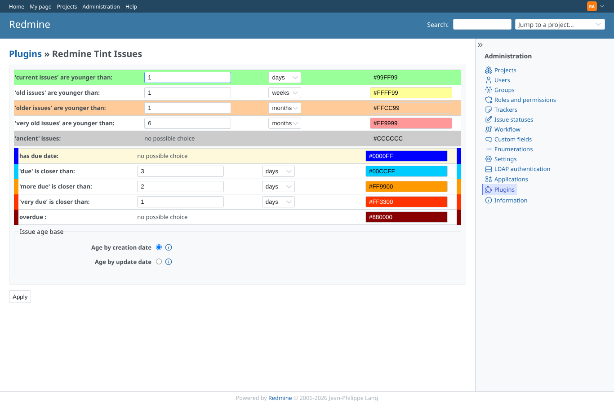
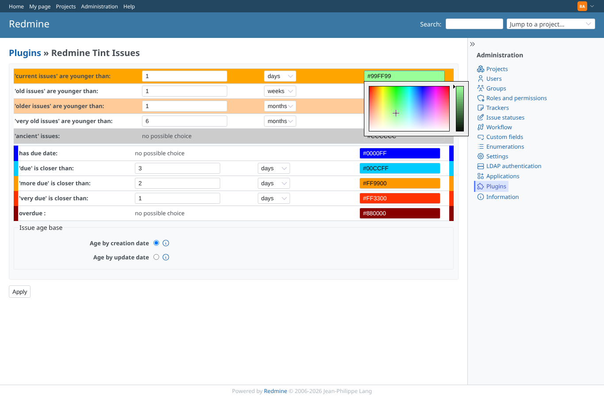
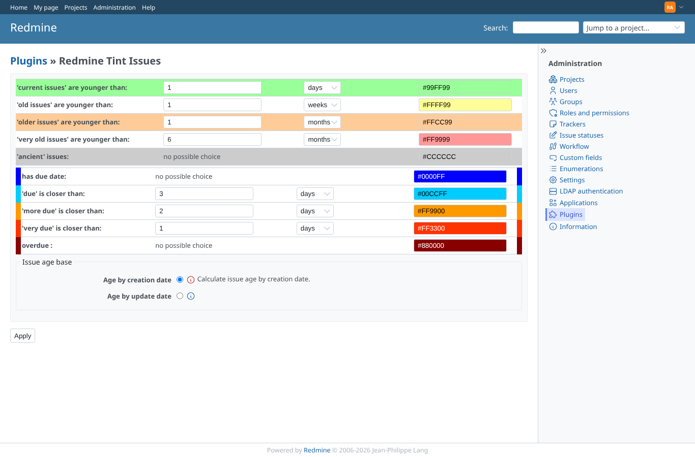
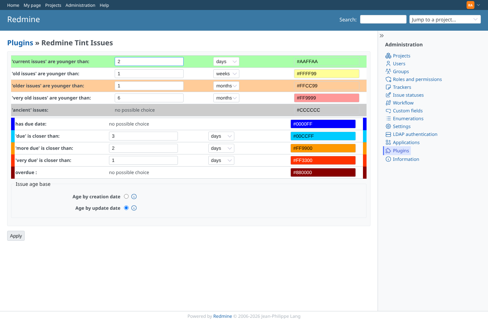
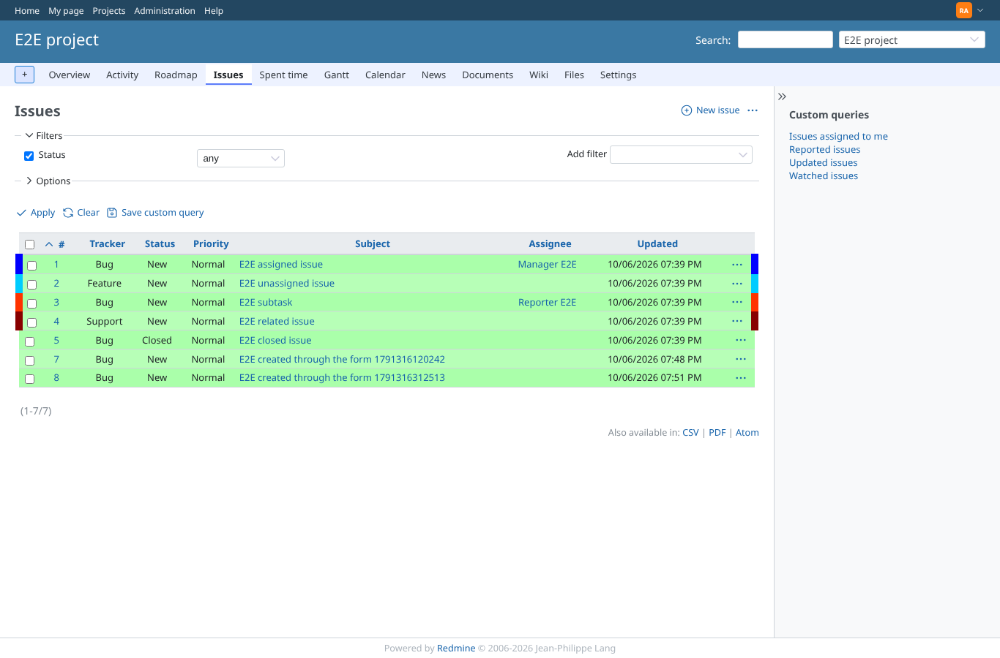
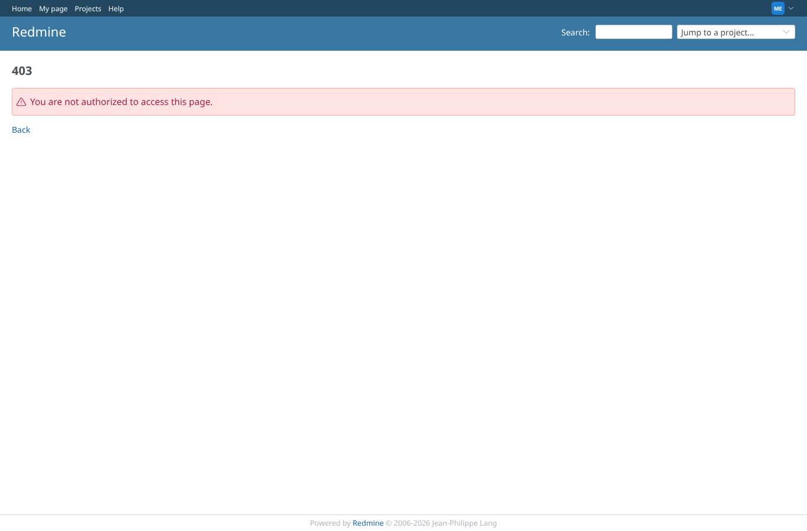
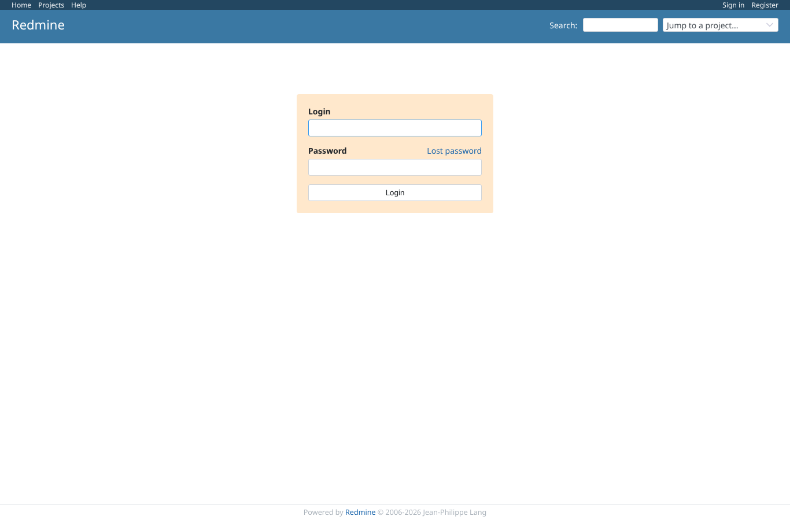

# settings

Run 2026-10-06T19:52:56.631Z against http://127.0.0.1:3000.

| screenshot | user | URL | shows |
|---|---|---|---|
|  | admin | `/settings/plugin/redmine_tint_issues` | Settings page: ages and due thresholds with unit selects, colour fields, age base radios |
|  | admin | `/settings/plugin/redmine_tint_issues` | Colour picker open with colour square and slider (images served from /assets/plugin_assets/) |
|  | admin | `/settings/plugin/redmine_tint_issues` | Help icon (SVG) toggles the explanation of the age base |
|  | admin | `/settings/plugin/redmine_tint_issues` | After saving and reloading: new values persisted |
|  | admin | `/projects/e2e-project/issues?set_filter=1&status_id=*&sort=id` | List uses the saved colours |
|  | manager | `/settings/plugin/redmine_tint_issues` | A non-administrator is refused |
|  | anonymous | `/login?back_url=http%3A%2F%2F127.0.0.1%3A3000%2Fsettings%2Fplugin%2Fredmine_tint_issues` | Anonymous is sent to the login page |
