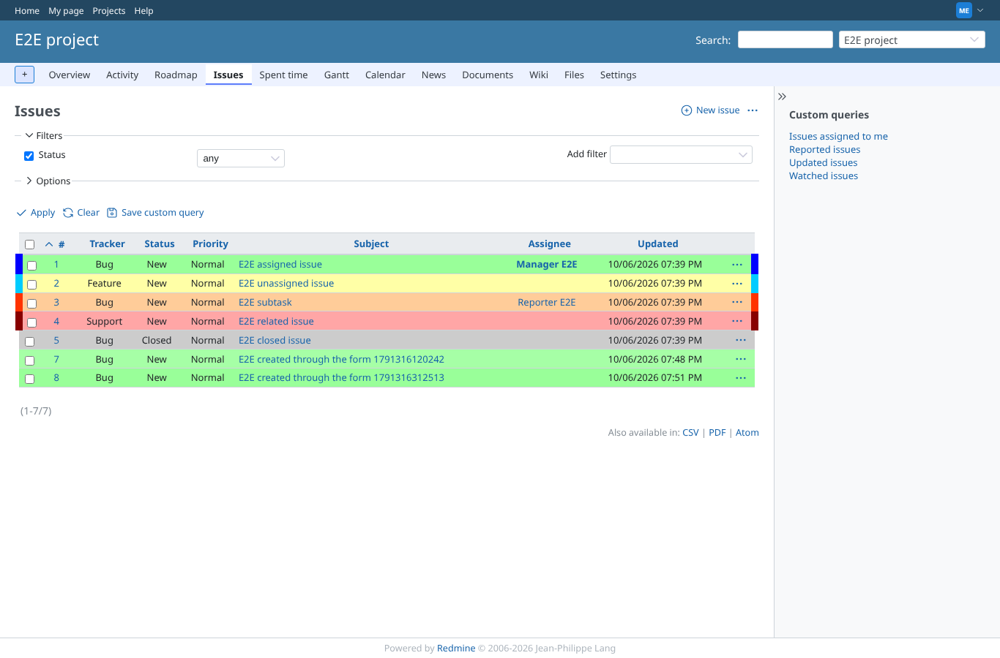
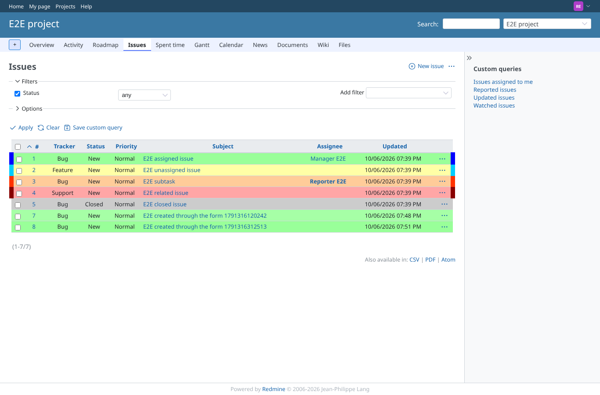
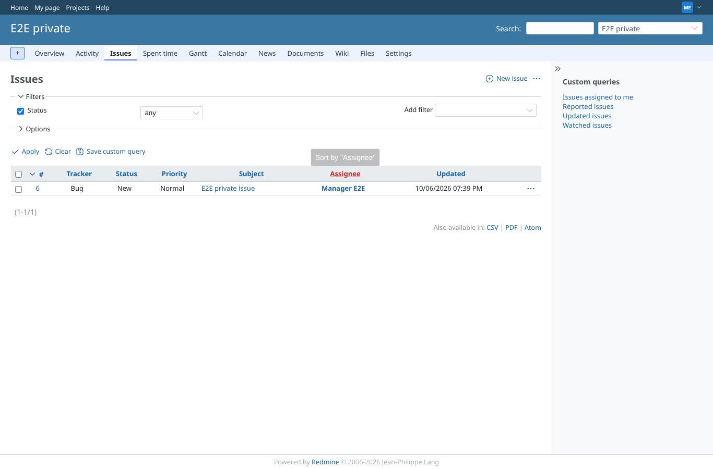
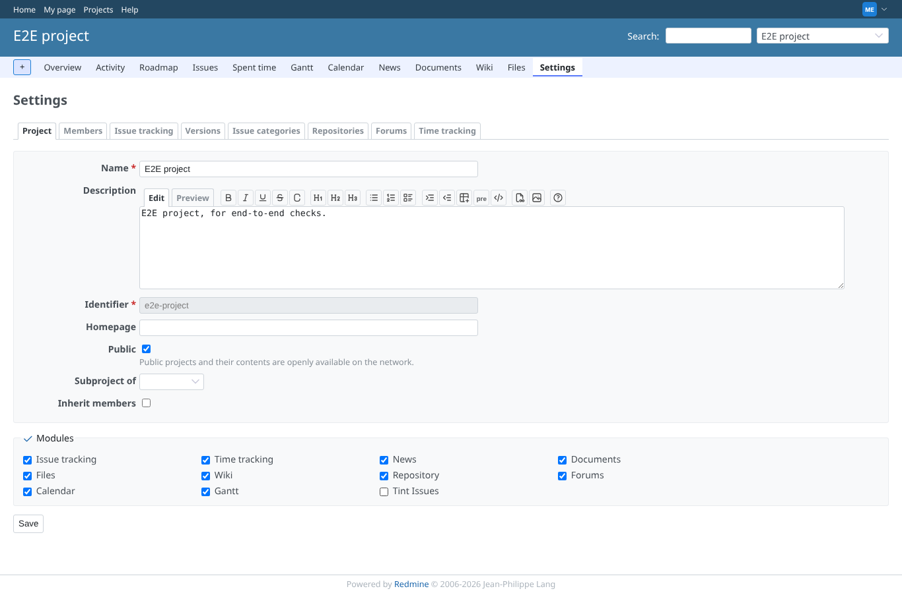
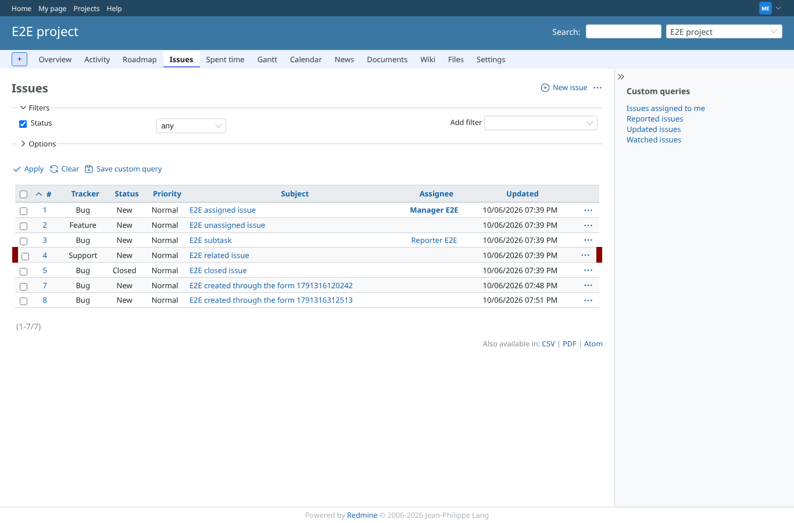
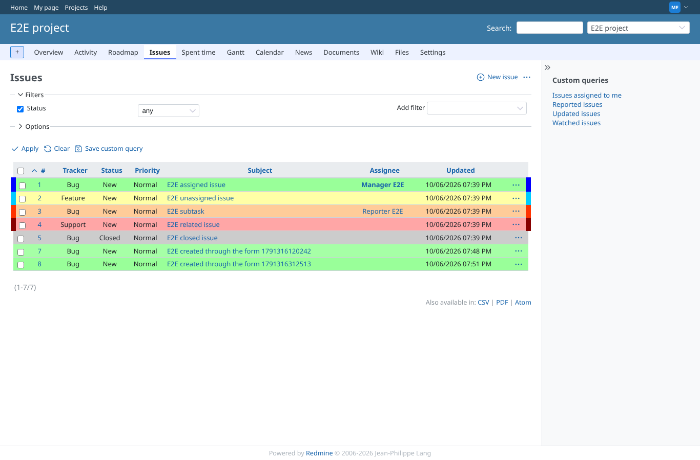
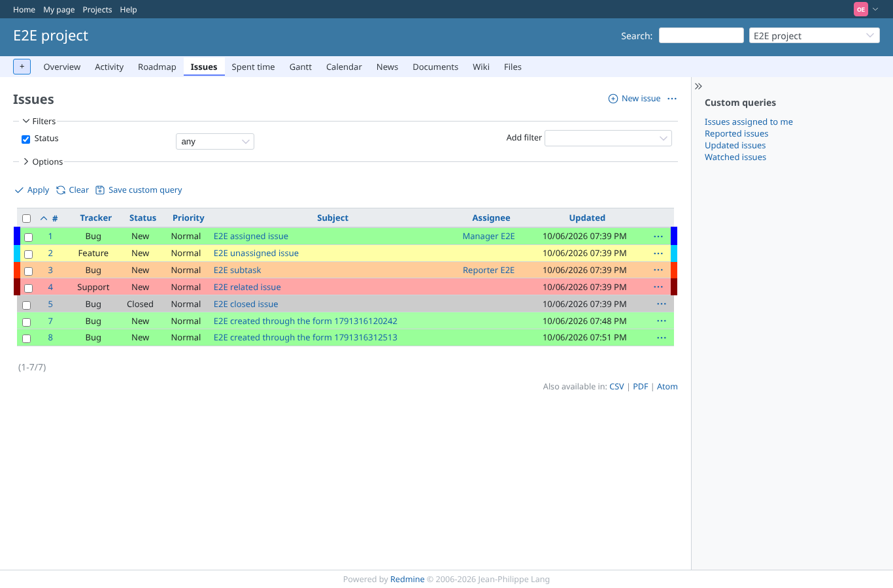

# tint-issues

Run 2026-10-06T19:53:09.076Z against http://127.0.0.1:3000.

| screenshot | user | URL | shows |
|---|---|---|---|
|  | manager | `/projects/e2e-project/issues?set_filter=1&status_id=*&sort=id` | Module on: rows tinted by age (background) and due date (10px side borders), as the manager |
|  | reporter | `/projects/e2e-project/issues?set_filter=1&status_id=*&sort=id` | A member without plugin permissions sees the same tint (the module, not the permission, switches it) |
|  | manager | `/projects/e2e-private/issues?set_filter=1&status_id=*` | Module off in this project: an 8 months old issue gets no tint class and no colour |
|  | manager | `/projects/e2e-project/settings` | Project settings, information tab: module Tint Issues unchecked |
|  | manager | `/projects/e2e-project/issues?set_filter=1&status_id=*&sort=id` | After switching the module off the list is plain again |
|  | manager | `/projects/e2e-project/issues?set_filter=1&status_id=*&sort=id` | Module on again: tint is back |
|  | outsider | `/projects/e2e-private/issues` | Outsider: the private project is refused |
|  | outsider | `/projects/e2e-project/issues?set_filter=1&status_id=*&sort=id` | Outsider: public project list is tinted as for everybody |
